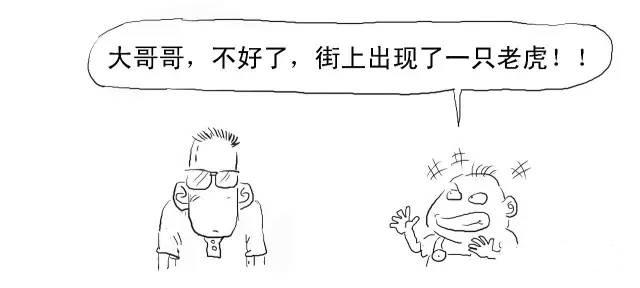
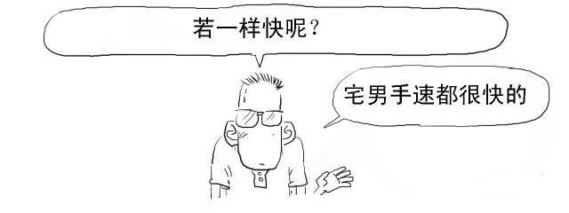

取快链?你想说的是区块链吧?

要说清楚区块链，我们先来讲个故事。

你一定听说过三人成虎的故事吧?

假设一个人告诉你，不好了，大街上有只老虎，你相不相信?

我去，你咋不按常理出牌啊，你要说不相信!

重来!我们说的是真老虎!

Action!!!

好!非常好!!影帝级的演出!!!

继续，这时候换做一堆人告诉你这件事!

我们再换一种场景。

如果一个德高望重、你十分信任的老者告诉你这件事，你又会怎么想?

是的，这就是所谓的信任的力量。你不信任一个没有足够信用度的单独个体，

但你会信任一堆个体或者有足够信用度的单独个体。

在现实社会中，银行就是这个有足够信用度的个体(中心)。

但以银行等作为信用中介是需要成本的，

而我们普通大众就要为这庞大的信用成本买单。

所以才会造就金融业是最赚钱的行业。

要去除银行类等中心机构的信用成本?

那就可以用我们上面提到过的"一堆个体"，这也是区块链技术的核心。

区块链本质上是解决信任问题、降低信任成本的技术方案，

目的就是为了去中心化，去信用中介。

区块链是比特币的底层技术。

比特币(BitCoin)的概念最初由中本聪在2009年提出，你把它理解成数字货币即可。

我们以比特币交易为例来看看区块链具体是如何操作的。

1、把每笔交易在全网广播。让全网承认有效，必须广播给每个节点。

2、矿工节点接收到交易信息后，都要拿出账簿本记载该次交易。

一旦记录，就不可撤销，不能随意销毁。

矿工节点是通过电脑运行的比特币软件对交易的进行确认的。

为了鼓励矿工的服务，对于其所记录和确认的交易，

系统为矿工提供25个比特币作为奖励。(这个奖励数量，系统设定每4年减半)

奖励只有一份，那就看谁记录的快呗。

为了减少这种情况，系统会出一道十分钟的运算题，

谁能最快解出值，谁就将获得记录入账权利，并赢得奖励。

对了，这里可以给大家看一道据说是徐汇区幼儿园升小学的运算题。

别急啊，你试试看，我第一次反正是做错了。

……，好吧，我无力反驳。

说远了，我们再说回来。

前述区块链中所运用算法并不是简单的计算题，而是使用哈希散列(Hash)算法。

哈希散列是密码学里的经典技术，可以用来验证有没有人篡改数据内容。

3、获得记账权的矿工将向全网广播该笔交易，账簿公开，其他矿工将核对确认这些账目。交易达到6个确认以上就成功记录在案了。

矿工记录的时候，还会将该笔交易盖上时间戳，形成一个完整时间链。

4、当其它矿工对账簿记录都确认无误后，该记录就确认合法，矿工们就进入了下一轮记账权争夺战。

矿工的每个记录，就是一个区块(block)，会盖上时间戳，每个新产生的区块严格按照时间线形顺序推进，形成不可逆的链条(chain)，所以叫做区块链(Blockchain)。

而且每个区块都含有其上一个区块的哈希值，确保区块按照时间顺序连接的同时没有被篡改。

这时候我们再看对区块链的原始定义就能理解了：区块链是一种分布式数据库，是一串使用密码学方法相关联产生的数据块，每个数据块都包含了一次网络交易信息，用于验证其信息的有效性和生成下一个区块。

若两个人同时上传，虽然这个概率很小，但是若发生，我们就看最后的区块链哪条更长，短的那条就失效。这就是区块链中的"双花问题"(同一笔钱花两次)。对于要制作虚假交易，除非你说服了全网里超过51%的矿工都更改某一笔账目，否则你的篡改都是无效的。

网络中参与人数越多，实现造假可能性越低。

这也是集体维护和监督的优越性，伪造成本最大化。

说服51%的人造假还是灰常灰常难的。

好了，我们总结下，区块链主要有以下核心内容：

1、去中心化

这是区块链颠覆性特点，不存在任何中心机构和中心服务器，所有交易都发生在每个人电脑或手机上安装的客户端应用程序中。

实现点对点直接交互，既节约资源，使交易自主化、简易化，又排除被中心化代理控制的风险。

2、开放性

区块链可以理解为一种公共记账的技术方案，系统是完全开放透明的，账簿对所有人公开，实现数据共享，任何人都可以查账。开放效果类似这样：

3、不可撤销、不可篡改和加密安全性

区块链采取单向哈希算法，每个新产生的区块严格按照时间线形顺序推进，时间的不可逆性、不可撤销导致任何试图入侵篡改区块链内数据信息的行为易被追溯，导致被其他节点的排斥，造假成本极高，从而可以限制相关不法行为。
